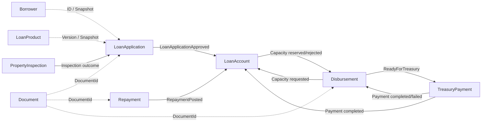

# Loan Management System — Aggregate Design

## 1. Purpose

This document defines the initial aggregate model for the Loan Management System MVP.

The goal is to establish:

- Aggregate Roots
- Entity ownership
- Value Objects
- Domain invariants
- Transaction boundaries
- Domain events
- Cross-aggregate coordination rules

The model is intentionally pragmatic: DDD patterns are used where they protect meaningful business behavior, not as ceremony.

---

# 2. Aggregate Design Principles

## 2.1 One Aggregate Owns One Consistency Boundary

A rule that must always be true immediately after a transaction should have one clear aggregate owner.

## 2.2 No Aggregate References Another Aggregate by Object Graph

Cross-aggregate references use identifiers:

```text
BorrowerId
LoanProductVersionId
LoanApplicationId
LoanId
DisbursementId
PaymentId
DocumentId
```

not loaded domain objects.

## 2.3 Cross-Context State Propagation Uses Contracts or Events

No aggregate directly calls another module's repository or DbContext.

## 2.4 Aggregates Stay Small

Long-running workflows are not modeled as a single giant aggregate.

## 2.5 Historical Decisions Use Snapshots

Changing borrower/product master data must not rewrite previously approved business decisions.

---

# 3. Borrower Aggregate

## Aggregate Root

```text
Borrower
```

## Owned Data

```text
Borrower
├── BorrowerId
├── CivilNumber
├── EmployeeNumber
├── FullName
├── PhoneNumber
├── Organization
├── RankGrade
├── EmploymentInfo
└── Status
```

## Candidate Value Objects

- `CivilNumber`
- `EmployeeNumber`
- `PersonName`
- `PhoneNumber`
- `EmploymentInfo`

Use a Value Object only when validation/behavior justifies it.

## Commands

- `RegisterBorrower`
- `UpdateBorrower`
- `ActivateBorrower`
- `DeactivateBorrower`

## Invariants

- Civil Number is required and structurally valid.
- Civil Number is unique at persistence boundary.
- Employee Number is unique when present.
- Deactivated borrower cannot be treated as active for new applications.

## Domain Events

- `BorrowerRegistered`
- `BorrowerUpdated`
- `BorrowerActivated`
- `BorrowerDeactivated`

---

# 4. Loan Product Aggregate

## Aggregate Root

```text
LoanProduct
```

## Owned Structure

```text
LoanProduct
├── LoanProductId
├── Name
├── Status
└── Versions
    └── LoanProductVersion
        ├── VersionId
        ├── MaximumAmount
        ├── DeductionPercentage
        ├── FinancingTypes
        ├── EligibilityConfiguration
        ├── EffectiveFrom
        └── EffectiveTo
```

A published version is immutable.

Editing a published product creates a new version.

## Candidate Value Objects

- `Money`
- `Percentage`
- `EffectivePeriod`
- `FinancingType`
- `EligibilityConfiguration`

## Invariants

- Maximum amount must be positive.
- Deduction percentage must be within the valid configured range.
- Effective period must be valid.
- Published version cannot be mutated.
- Product cannot have contradictory active versions for the same period unless explicitly supported.

## Domain Events

- `LoanProductCreated`
- `LoanProductVersionPublished`
- `LoanProductActivated`
- `LoanProductDeactivated`

---

# 5. Loan Application Aggregate

## Aggregate Root

```text
LoanApplication
```

## Owned Structure

```text
LoanApplication
├── LoanApplicationId
├── BorrowerId
├── BorrowerSnapshot
├── LoanProductId
├── LoanProductVersionId
├── ProductSnapshot
├── RequestedAmount
├── ApprovedAmount
├── FinancingType
├── EligibilityDecision
├── Status
├── UnitApproval
├── CommitteeApproval
├── InspectionPrerequisiteStatus
├── MortgageStatus
├── RequiredDocumentReferences
└── ApprovalHistory
```

Property inspection details may live in a separate aggregate inside the same bounded context.

The application keeps only the inspection outcome needed for its own lifecycle.

## Candidate Value Objects

- `Money`
- `BorrowerSnapshot`
- `LoanProductSnapshot`
- `EligibilityDecision`
- `ApprovalDecision`
- `MortgageStatus`
- `ApplicationStatus`

## Commands / Behaviors

```text
Create
EvaluateEligibility
Submit
ApproveByUnit
ApproveByCommittee
MarkInspectionApproved
MarkInspectionRejected
MarkMortgageCompleted
Approve
Reject
Cancel
```

## Core Invariants

### Submission

Application can be submitted only when:

- status is Draft;
- required fields are complete;
- eligibility permits submission;
- selected product version is valid;
- required initial documents exist.

### Unit Approval

Only a Submitted application may receive Unit approval.

### Committee Approval

Committee approval requires Unit approval.

### Final Approval

Final approval requires:

- Unit approval;
- Committee approval;
- approved inspection when required;
- mortgage readiness when required;
- required documents;
- valid approved amount.

### Rejection

A rejected application cannot continue normal approval flow.

### Cancellation

A cancelled application cannot continue normal approval flow.

### Approved Amount

```text
0 < ApprovedAmount <= applicable product/rule limit
```

subject to final business rules.

## Domain Events

- `LoanApplicationCreated`
- `EligibilityEvaluated`
- `LoanApplicationSubmitted`
- `UnitApprovalGranted`
- `CommitteeApprovalGranted`
- `ApplicationInspectionApproved`
- `ApplicationInspectionRejected`
- `MortgageCompleted`
- `LoanApplicationApproved`
- `LoanApplicationRejected`
- `LoanApplicationCancelled`

---

# 6. Property Inspection Aggregate

## Aggregate Root

```text
PropertyInspection
```

## Context

Loan Origination.

## Owned Structure

```text
PropertyInspection
├── PropertyInspectionId
├── LoanApplicationId
├── InspectorId
├── PropertyDetails
├── InspectionDate
├── Result
├── Status
└── Notes
```

## Candidate Value Objects

- `PropertyDetails`
- `PropertyArea`
- `InspectionResult`

## Invariants

- Inspection belongs to exactly one loan application.
- Completed inspection must have an inspector and date.
- Approved/rejected inspection must contain a valid result.
- Finalized inspection cannot be silently edited; changes require an explicit correction/reinspection workflow.

## Domain Events

- `PropertyInspectionRecorded`
- `PropertyInspectionApproved`
- `PropertyInspectionRejected`

## Coordination

A local domain-event handler updates the related `LoanApplication` prerequisite status.

---

# 7. Loan Account Aggregate

## Aggregate Root

```text
LoanAccount
```

## Owned Structure

```text
LoanAccount
├── LoanId
├── SourceApplicationId
├── BorrowerId
├── ApprovedAmount
├── ReservedDisbursementAmount
├── TotalDisbursed
├── TotalRepaid
├── Status
└── DisbursementReservations
    └── Reservation
        ├── DisbursementId
        ├── Amount
        └── Status
```

The reservation collection prevents the same disbursement from reserving capacity twice.

## Derived Values

```text
AvailableToDisburse =
ApprovedAmount
- TotalDisbursed
- ReservedDisbursementAmount
```

Initial MVP:

```text
OutstandingBalance =
TotalDisbursed
- TotalRepaid
```

## Behaviors

```text
Open
ReserveDisbursementCapacity
ReleaseDisbursementCapacity
ConfirmDisbursement
ApplyRepayment
MarkFullyRepaid
Close
```

## Critical Invariants

### Capacity

```text
TotalDisbursed
+ ReservedDisbursementAmount
<= ApprovedAmount
```

at all times.

### Reservation

- Same `DisbursementId` cannot reserve twice.
- Reservation amount must be positive.
- Released reservation cannot be confirmed.
- Confirmed reservation cannot be released again.

### Disbursement Confirmation

Only a valid active reservation can become a confirmed disbursement.

### Repayment

- repayment amount must be positive;
- same repayment event/reference cannot be applied twice;
- MVP default: repayment cannot make balance negative.

### Closing

Loan cannot be closed while outstanding balance is positive.

## Domain Events

- `LoanAccountOpened`
- `DisbursementCapacityReserved`
- `DisbursementCapacityRejected`
- `DisbursementCapacityReleased`
- `LoanDisbursementConfirmed`
- `LoanRepaymentApplied`
- `LoanFullyRepaid`
- `LoanClosed`

---

# 8. Disbursement Aggregate

## Aggregate Root

```text
Disbursement
```

## Owned Structure

```text
Disbursement
├── DisbursementId
├── LoanId
├── Amount
├── Beneficiary
├── Status
├── TechnicalApproval
├── AccountingApproval
├── HigherOfficerApproval
├── CapacityReservationStatus
└── CreatedAt
```

## Important Ownership Rule

The Disbursement aggregate owns:

> the administrative workflow for releasing funds.

It does **not** own:

> the loan's remaining financial capacity.

That invariant belongs to `LoanAccount`.

## State Concept

```text
PendingCapacity
Requested
TechnicalApproved
AccountingApproved
ReadyForTreasury
TreasuryProcessing
Completed
PaymentFailed
Rejected
Cancelled
```

## Invariants

- Amount must be positive.
- Administrative approval cannot begin until capacity is reserved.
- Accounting approval requires technical approval.
- Higher approval requires accounting approval.
- Treasury processing requires higher approval.
- Completed disbursement cannot be approved/rejected again.
- Rejected/cancelled disbursement must release unused capacity.

## Domain Events

- `DisbursementCreated`
- `DisbursementCapacityRequested`
- `DisbursementRequested`
- `DisbursementTechnicalApprovalGranted`
- `DisbursementAccountingApprovalGranted`
- `DisbursementHigherApprovalGranted`
- `DisbursementReadyForTreasury`
- `DisbursementRejected`
- `DisbursementCancelled`
- `DisbursementPaymentFailed`
- `DisbursementCompleted`

---

# 9. Treasury Payment Aggregate

## Aggregate Root

```text
TreasuryPayment
```

## Owned Structure

```text
TreasuryPayment
├── TreasuryPaymentId
├── DisbursementId
├── Amount
├── Beneficiary
├── Status
├── InputDecision
├── AuditDecision
├── ApprovalDecision
├── PaymentReference
├── FailureReason
└── AttemptMetadata
```

## Candidate Statuses

```text
Pending
Entered
Audited
Approved
Processing
Paid
Failed
Rejected
```

## Invariants

- Amount must equal the approved disbursement payment amount.
- Audit requires input completion.
- Final treasury approval requires successful audit.
- Execution requires final approval.
- Paid payment cannot execute again.
- Payment retries must use idempotency protections.
- External bank/payment reference must be unique where required.

## Behaviors

```text
Enter
Audit
Reject
Approve
StartExecution
MarkPaid
MarkFailed
Retry
```

## Domain Events

- `TreasuryPaymentCreated`
- `TreasuryPaymentEntered`
- `TreasuryPaymentAudited`
- `TreasuryPaymentApproved`
- `PaymentExecutionRequested`
- `TreasuryPaymentCompleted`
- `TreasuryPaymentFailed`
- `TreasuryPaymentRejected`

---

# 10. Repayment Aggregate

## Aggregate Root

```text
Repayment
```

## Owned Structure

```text
Repayment
├── RepaymentId
├── LoanId
├── Amount
├── PaymentDate
├── Source
├── ExternalReference
├── ReceiptDocumentId
├── Status
└── PostingMetadata
```

## Sources

```text
Manual
SalaryDeduction
```

## Invariants

- Amount > 0.
- Loan reference is required.
- Repayment source is valid.
- Required external reference/receipt is present.
- Duplicate posting is rejected.
- MVP default: posted repayment must not result in negative outstanding balance.

## Behaviors

```text
Record
Validate
Post
Reject
```

## Domain Events

- `RepaymentRecorded`
- `RepaymentPosted`
- `RepaymentRejected`

---

# 11. Salary Deduction Batch Aggregate / Process

This can be implemented as a lightweight process aggregate if persistent batch tracking is required.

## Aggregate Root

```text
SalaryDeductionBatch
```

## Owned Structure

```text
SalaryDeductionBatch
├── BatchId
├── SourceFileDocumentId
├── UploadedAt
├── Status
├── RowCount
├── SuccessCount
├── FailureCount
└── RowResults
```

## Responsibilities

- batch-level idempotency;
- validation summary;
- row result tracking;
- auditability of payroll import.

Individual successful payments still become separate `Repayment` aggregates.

---

# 12. Document Aggregate

## Aggregate Root

```text
Document
```

## Owned Structure

```text
Document
├── DocumentId
├── FileName
├── ContentType
├── StorageKey
├── UploadedBy
├── UploadedAt
└── Status
```

## Invariants

- Storage key is required after successful persistence.
- Document identifiers are immutable.
- Retention/delete rules must respect linked business records and audit requirements.

The Document aggregate does not own the business meaning of the document.

For example, Loan Origination decides whether a document satisfies "ownership proof".

---

# 13. Audit Entry

Audit is intentionally append-only.

It is not modeled as a complex transactional aggregate.

```text
AuditEntry
├── AuditEntryId
├── ActorId
├── Action
├── EntityType
├── EntityId
├── Timestamp
├── PreviousState
├── NewState
├── Reason
└── CorrelationId
```

No business context reads Audit to decide whether an operation is valid.

---

# 14. Reporting Models

Reporting uses projections/read models rather than aggregates.

Examples:

```text
LoanApplicationSummary
ActiveLoanSummary
DisbursementSummary
RepaymentSummary
OutstandingBalanceSummary
```

Reporting is never the transactional source of truth.

---

# 15. Aggregate Interaction Map



---

# 16. Transaction Boundaries

## Single Aggregate Transactions

The default rule is one aggregate per transaction.

Examples:

```text
LoanApplication.ApproveByCommittee()
LoanAccount.ReserveDisbursementCapacity()
Disbursement.ApproveByAccounting()
TreasuryPayment.MarkPaid()
Repayment.Post()
```

## Cross-Aggregate Coordination

Use domain/integration events and policies.

Do not create a transaction that directly modifies:

```text
LoanAccount + Disbursement + TreasuryPayment
```

as one object graph.

---

# 17. Cross-Context Reliability

For business-critical events, use:

```text
Transactional Outbox
+
Idempotent Inbox / Consumer
```

Examples:

```text
LoanApplicationApproved
DisbursementCapacityRequested
DisbursementCapacityReserved
DisbursementReadyForTreasury
TreasuryPaymentCompleted
RepaymentPosted
```

No external broker is required for MVP.

The implementation may dispatch persisted events in-process.

---

# 18. Optimistic Concurrency

Financial aggregates should use optimistic concurrency.

Priority aggregates:

- `LoanAccount`
- `Disbursement`
- `TreasuryPayment`
- `Repayment`

Example failure scenario protected by concurrency:

```text
Two users request disbursements at the same time.
```

Only reservations that preserve:

```text
TotalDisbursed + Reserved <= ApprovedAmount
```

may succeed.

Implementation may use SQL Server rowversion/concurrency tokens.

---

# 19. Idempotency Requirements

Idempotency is mandatory for:

- external payment execution;
- treasury payment completion callback/result handling;
- salary deduction import;
- repayment posting;
- integration event consumers;
- disbursement capacity reservation;
- disbursement confirmation.

Use stable business identifiers/correlation IDs, not only HTTP request retries.

---

# 20. Initial Aggregate List

| Bounded Context | Aggregate Root |
|---|---|
| Borrowers | `Borrower` |
| Loan Products | `LoanProduct` |
| Loan Origination | `LoanApplication` |
| Loan Origination | `PropertyInspection` |
| Loan Accounts | `LoanAccount` |
| Disbursements | `Disbursement` |
| Treasury | `TreasuryPayment` |
| Repayments | `Repayment` |
| Repayments | `SalaryDeductionBatch` (if persistent tracking required) |
| Documents | `Document` |

Identity aggregates will be designed with the authentication/authorization implementation.

Audit and Reporting are not treated as rich domain aggregates.

---

# 21. Key Domain Decisions

## Decision 1 — Application and Loan are separate aggregates

```text
LoanApplication != LoanAccount
```

Reason:

- different lifecycle;
- different invariants;
- different long-term responsibility.

## Decision 2 — Loan Account owns disbursement capacity

Reason:

Only `LoanAccount` has enough authoritative information to enforce:

```text
TotalDisbursed + Reserved <= ApprovedAmount
```

## Decision 3 — Disbursement owns administrative release workflow

Reason:

Approval workflow and loan financial state are separate concepts.

## Decision 4 — Treasury owns payment execution

Reason:

Bank/B2B integration and financial maker-checker flow must not leak into Loan/Disbursement domain code.

## Decision 5 — Repayment is separate from Loan Account

Reason:

Repayment intake, import, validation, duplicate detection, and receipt handling are separate workflows.

Loan Account only applies an accepted repayment to financial state.

## Decision 6 — Property Inspection is a separate aggregate inside Loan Origination

Reason:

Inspection has its own lifecycle/data but remains part of the same bounded context for MVP.

## Decision 7 — Mortgage is not a separate aggregate in MVP

Reason:

Current MVP requirement is mainly prerequisite/status tracking.

If mortgage workflow becomes independently complex, it can later become its own aggregate/context.

## Decision 8 — Cross-context consistency is event-driven

Reason:

Avoid cross-module persistence coupling and distributed object graphs.

---

# 22. Open Decisions for Later Confirmation

The aggregate model intentionally leaves these as explicit policies:

- exact eligibility formula;
- allowed overpayment behavior;
- retry policy for failed treasury payments;
- release policy for failed payment reservations;
- reinspection rules;
- mortgage detail workflow;
- return-for-correction approval states;
- loan interest/accounting model if required beyond principal tracking.

These do not block implementing the modular domain skeleton.
