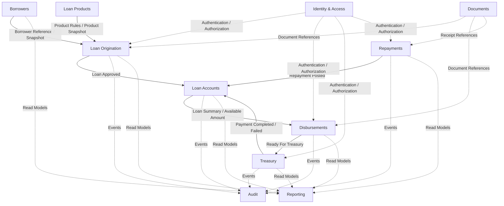

# Loan Management System — DDD Context Map

## 1. Purpose

This document defines the Domain-Driven Design (DDD) context map for the Loan Management System MVP.

It establishes:

- bounded contexts;
- ownership of business concepts;
- upstream/downstream relationships;
- allowed communication patterns;
- integration boundaries;
- responsibilities that must remain separated.

This context map is a baseline architectural artifact for the Modular Monolith implementation.

---

## 2. Context Map Overview



---

## 3. Bounded Contexts

### 3.1 Identity & Access

**Responsibility**

- users;
- roles;
- permissions;
- authentication;
- authorization;
- user activation/deactivation.

**Owns**

- User
- Role
- Permission

**Does not own**

- loan approval rules;
- borrower eligibility;
- treasury decisions.

Business modules shall not directly depend on Identity persistence.

---

### 3.2 Borrowers

**Responsibility**

Maintain borrower master data.

**Owns**

- Borrower
- Civil Number
- Employee Number
- Employment Information
- Organization
- Rank / Grade
- Borrower Status

**Provides to Loan Origination**

- borrower identity/reference;
- borrower data required for application and eligibility;
- borrower snapshot inputs.

**Important boundary**

Borrowers answers:

> Who is the borrower?

It does **not** answer:

> Is this borrower eligible for this loan?

Eligibility belongs to Loan Origination.

---

### 3.3 Loan Products

**Responsibility**

Define configurable loan products and rule parameters.

**Owns**

- Loan Product
- Product Status
- Maximum Amount
- Deduction Percentage
- Financing Types
- Eligibility Configuration
- Effective Dates
- Product Version

**Provides to Loan Origination**

- product definition;
- applicable configuration;
- rule parameters;
- versioned product snapshot.

**Important boundary**

Loan Products defines rules/configuration.

Loan Origination applies those rules to a particular application.

---

### 3.4 Loan Origination

**Type**

Core Domain.

**Responsibility**

Manage the complete pre-loan lifecycle.

**Owns**

- Loan Application
- Eligibility Decision
- Administrative Application Approval
- Property Inspection
- Mortgage Readiness
- Application Rejection
- Application Cancellation
- Approval History

**Primary lifecycle**

```text
Draft
  ↓
Submitted
  ↓
Unit Approved
  ↓
Committee Approved
  ↓
Inspection
  ↓
Mortgage / Document Readiness
  ↓
Approved
```

**Produces**

- LoanApplicationSubmitted
- LoanApplicationRejected
- LoanApplicationCancelled
- LoanApplicationApproved

**Downstream**

Loan Accounts.

When an application becomes finally approved, Loan Origination publishes a business event/contract that allows Loan Accounts to create the active loan.

---

### 3.5 Loan Accounts

**Type**

Core Domain.

**Responsibility**

Represent the active financial loan after origination is completed.

**Owns**

- Loan Account
- Approved Amount
- Total Committed / Disbursed Amount
- Total Repaid
- Outstanding Balance
- Loan Status

**Important distinction**

```text
Loan Application != Loan Account
```

A Loan Application represents a request and approval process.

A Loan Account represents the financial obligation created after approval.

**Consumes**

- LoanApplicationApproved
- TreasuryPaymentCompleted
- RepaymentPosted

**Produces**

Potential events such as:

- LoanActivated
- LoanFullyRepaid
- LoanClosed

---

### 3.6 Disbursements

**Type**

Core Domain.

**Responsibility**

Manage administrative authorization to release loan funds.

**Owns**

- Disbursement Request
- Requested Amount
- Administrative Approval State
- Technical Approval
- Accounting Approval
- Higher Officer Approval
- Commitment / Reservation State

**Critical invariant**

```text
Existing committed disbursements
+ New disbursement
<= Approved Loan Amount
```

A pending or approved disbursement may reserve loan capacity before the actual payment occurs.

**Produces**

- DisbursementRequested
- DisbursementApproved
- DisbursementReadyForTreasury

**Downstream**

Treasury.

---

### 3.7 Treasury

**Type**

Supporting Domain.

**Responsibility**

Manage financial processing and execution of approved disbursements.

**Owns**

- Treasury Payment
- Treasury Input
- Treasury Audit
- Treasury Approval
- Payment Execution State
- Payment Failure State

**Primary lifecycle**

```text
Pending
  ↓
Entered
  ↓
Audited
  ↓
Approved
  ↓
Processing
  ↓
Paid / Failed
```

**External integration**

Treasury owns the payment gateway boundary:

```text
IPaymentGateway
    ├── FakePaymentGateway      (MVP)
    └── B2BPaymentGateway       (Future)
```

No other business context shall directly call the banking/B2B API.

**Produces**

- TreasuryPaymentCompleted
- TreasuryPaymentFailed

---

### 3.8 Repayments

**Type**

Core Domain.

**Responsibility**

Process and validate repayments.

**Owns**

- Repayment
- Repayment Source
- Salary Deduction Batch
- Manual Repayment
- Repayment Validation
- Duplicate Detection
- Posting Status

**Repayment sources**

- Salary Deduction
- Manual Payment

**Produces**

- RepaymentPosted

**Downstream**

Loan Accounts.

---

### 3.9 Documents

**Type**

Generic Supporting Context.

**Responsibility**

Manage document metadata and storage abstraction.

**Owns**

- Document ID
- File Metadata
- Storage Key
- Upload Metadata
- Storage Lifecycle

Other modules store document references rather than owning file storage.

**External integration**

```text
IFileStorage
    ├── LocalFileStorage        (MVP)
    └── FileServerStorage       (Future)
```

---

### 3.10 Audit

**Type**

Generic Supporting Context.

**Responsibility**

Maintain immutable audit history for critical actions.

**Consumes events from**

- Loan Origination
- Loan Accounts
- Disbursements
- Treasury
- Repayments
- configuration changes where relevant.

**Owns**

- Audit Entry
- Actor
- Action
- Entity
- Timestamp
- Old State
- New State
- Reason / Comment

Audit shall not own or modify business state.

---

### 3.11 Reporting

**Type**

Supporting / Read Model Context.

**Responsibility**

Provide operational reporting and read-optimized views.

**Consumes/read-models from**

- Borrowers
- Loan Origination
- Loan Accounts
- Disbursements
- Treasury
- Repayments

**Important boundary**

Reporting is read-only with respect to core business state.

It shall never perform commands such as:

```text
ApproveLoan
PostRepayment
ExecutePayment
```

---

## 4. Context Relationships

| Upstream | Downstream | Relationship | Purpose |
|---|---|---|---|
| Borrowers | Loan Origination | Published Contract | Borrower data/reference |
| Loan Products | Loan Origination | Published Contract | Product configuration/rules |
| Loan Origination | Loan Accounts | Integration Event | Create active loan after approval |
| Loan Accounts | Disbursements | Published Contract | Loan amount/status/available capacity |
| Disbursements | Treasury | Integration Event | Start financial processing |
| Treasury | Loan Accounts | Integration Event | Record completed payment |
| Repayments | Loan Accounts | Integration Event | Update repayment totals/balance |
| Business Contexts | Audit | Integration Events | Immutable audit trail |
| Business Contexts | Reporting | Read Models / Events | Operational reporting |
| Documents | Business Contexts | Shared Service Contract | File/document references |
| Identity & Access | Application Boundaries | Security Contract | Authentication/authorization |

---

## 5. Communication Rules

### Rule 1 — No Cross-Module DbContext Access

Forbidden:

```text
Disbursements
    ↓
LoanAccountsDbContext
```

A module must not directly query another module's persistence layer.

---

### Rule 2 — No Cross-Module Table Ownership

Each module owns its own business data.

A module must not modify another module's tables directly.

---

### Rule 3 — Synchronous Queries Use Public Contracts

When immediate information is required, use an explicit module contract.

Example:

```csharp
public interface ILoanAccountsModule
{
    Task<LoanSummary?> GetLoanSummaryAsync(
        LoanId loanId,
        CancellationToken cancellationToken);
}
```

The contract exposes only information intentionally published by the owning module.

---

### Rule 4 — State Changes Prefer Integration Events

Important cross-context state propagation should use integration events where immediate synchronous coupling is not required.

Example:

```text
LoanOrigination
    |
    | LoanApplicationApproved
    v
LoanAccounts
```

---

### Rule 5 — No Shared Domain Model

Do not share:

- Aggregate Roots;
- Entities;
- internal Value Objects;
- EF Core entities.

between bounded contexts.

Modules may share only small technical building blocks and explicit contracts.

---

### Rule 6 — IDs May Cross Boundaries

References such as these may cross module boundaries:

```text
BorrowerId
LoanApplicationId
LoanId
DisbursementId
PaymentId
DocumentId
```

but the referenced aggregate remains owned by its original module.

---

## 6. Snapshot Rules

Historical business decisions must not silently change when upstream master data changes.

### Loan Product Snapshot

At application submission/approval, capture relevant applied product information such as:

- Product ID
- Product Version
- Maximum Amount
- Deduction Percentage
- Applied Eligibility Parameters

Changing the Loan Product later must not alter an already-approved application.

### Borrower Snapshot

Where required for legal/business traceability, capture relevant borrower data used at the time of the application/decision.

---

## 7. External System Boundaries

External dependencies are adapters, not domain owners.

```text
Identity & Access
    └── Active Directory Adapter       (Future)

Borrowers
    └── HR Adapter                     (Future)

Treasury
    └── B2B Payment Adapter            (Future)

Documents
    └── File Server Adapter            (Future)

Reporting
    └── Power BI / Analytics Adapter   (Future)
```

MVP implementations may use local/fake adapters.

---

## 8. Recommended Modular Monolith Mapping

```text
src/
└── Modules/
    ├── IdentityAccess/
    ├── Borrowers/
    ├── LoanProducts/
    ├── LoanOrigination/
    ├── LoanAccounts/
    ├── Disbursements/
    ├── Treasury/
    ├── Repayments/
    ├── Documents/
    ├── Audit/
    └── Reporting/
```

These are logical module boundaries.

They do not require four separate assemblies per module for the MVP.

---

## 9. Key Architectural Decisions

The following distinctions are intentional and must remain explicit:

```text
Loan Application != Loan Account

Disbursement != Treasury Payment

Administrative Approval != Financial Processing

Repayment Processing != Loan Account

Borrower Master Data != Eligibility Decision

Loan Product Definition != Application Decision

Inspection belongs to Loan Origination for MVP

Mortgage belongs to Loan Origination for MVP

External Integrations != Core Domain
```

---

## 10. Baseline

This context map is the baseline for:

- Event Storming;
- Aggregate Design;
- module contracts;
- integration events;
- solution structure;
- architecture tests.

Any change to a bounded-context boundary should be treated as an architectural decision and reviewed explicitly.
