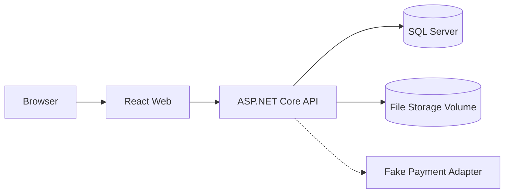

# Loan Management System — Docker and Local Runtime

## 1. Purpose

Docker is part of the implementation baseline for local development, demo, and reproducible setup.

## 2. Recommended Development Workflow

During active development:

```text
SQL Server       -> Docker
ASP.NET Core API -> dotnet watch
React Frontend   -> Vite dev server
```

This gives the fastest hot reload and debugger experience while keeping infrastructure reproducible.

## 3. Full Containerized Runtime

A full Compose setup will also be provided:

```text
docker compose up --build
```

Services:

```text
sqlserver
api
web
```

No Redis, RabbitMQ, or Kafka is required for MVP.

## 4. Runtime Topology



## 5. SQL Server Container

Use an official SQL Server image.

Requirements:

- named persistent volume;
- health check;
- credentials from environment/secrets;
- no hard-coded production password.

Conceptual Compose service:

```yaml
sqlserver:
  image: <official-sql-server-image>
  environment:
    ACCEPT_EULA: "Y"
    MSSQL_SA_PASSWORD: ${MSSQL_SA_PASSWORD}
  volumes:
    - sql_data:/var/opt/mssql
```

## 6. API Container

Use a multi-stage Dockerfile:

```text
restore
build
publish
runtime
```

Runtime configuration includes:

```text
ConnectionStrings__LoanSystem
Authentication__Mode
FileStorage__RootPath
PaymentGateway__Mode
```

## 7. React Container

Development:

```text
npm/pnpm dev
```

Container/demo:

```text
build SPA
→ serve static dist
```

The web-server choice is not a domain/architecture concern.

## 8. File Storage

MVP local storage:

```text
Docker named volume or host-mounted development directory
```

Example:

```text
loan_files:/app/data/files
```

SQL Server stores only file metadata and storage keys.

## 9. Health Checks

API:

```text
/health/live
/health/ready
```

Readiness should include SQL Server connectivity.

## 10. Startup

Target:

```text
SQL Server healthy
   ↓
API ready
   ↓
React usable
```

Do not rely only on container startup order.

## 11. Migrations

Development/test:
- may auto-apply migrations or use a local migration command.

Production:
- explicit migration step/job before API rollout.

Avoid multiple API replicas racing to migrate.

## 12. Environment Files

Repository should contain:

```text
.env.example
```

but never real secrets.

Likely variables:

```text
MSSQL_SA_PASSWORD
ConnectionStrings__LoanSystem
Authentication__Mode
FileStorage__RootPath
PaymentGateway__Mode
```

## 13. Files to Create When Coding Starts

```text
/
├── compose.yaml
├── .env.example
├── src/LoanSystem.Api/Dockerfile
└── frontend/loan-system-web/Dockerfile
```

## 14. Developer Commands

Database only:

```text
docker compose up -d sqlserver
```

Backend:

```text
dotnet watch --project src/LoanSystem.Api
```

Frontend:

```text
npm run dev --prefix frontend/loan-system-web
```

Full stack:

```text
docker compose up --build
```

## 15. Integration Tests

Preferred backend integration-test baseline:

```text
Testcontainers for .NET
```

Each integration-test run should be able to start an isolated SQL Server, apply migrations, run tests, and dispose the environment.

## 16. Production Independence

Domain/Application code must not know whether the application runs:

- locally;
- in Docker;
- on a VM;
- behind a reverse proxy.

Docker is an operational mechanism, not a domain dependency.

## 17. Baseline

```text
Development:
SQL Server in Docker
API/React locally for hot reload

Full Demo:
SQL Server + API + React via Compose

Persistent volumes:
SQL Server data
MVP file storage
```
