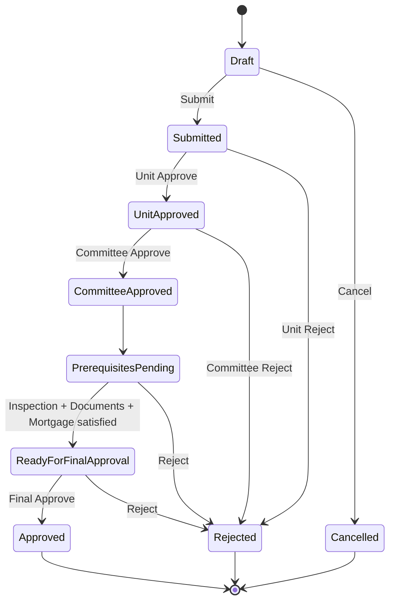
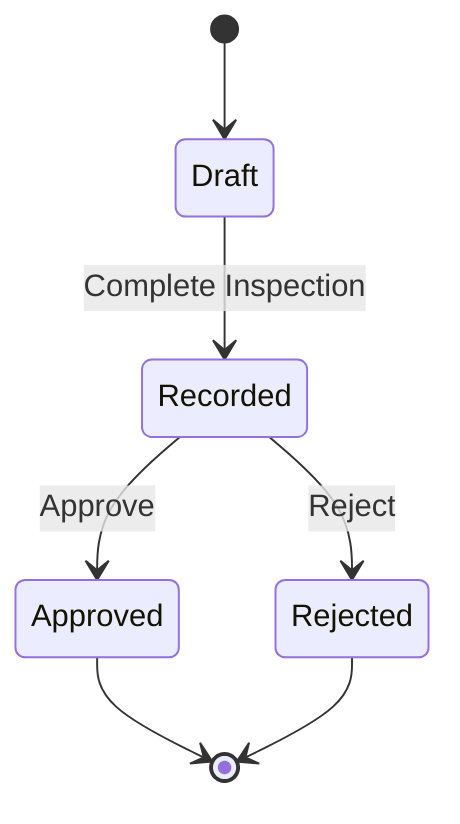
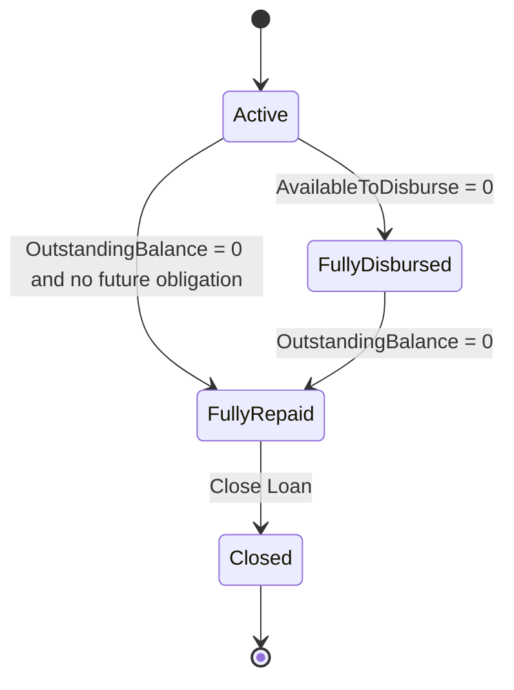
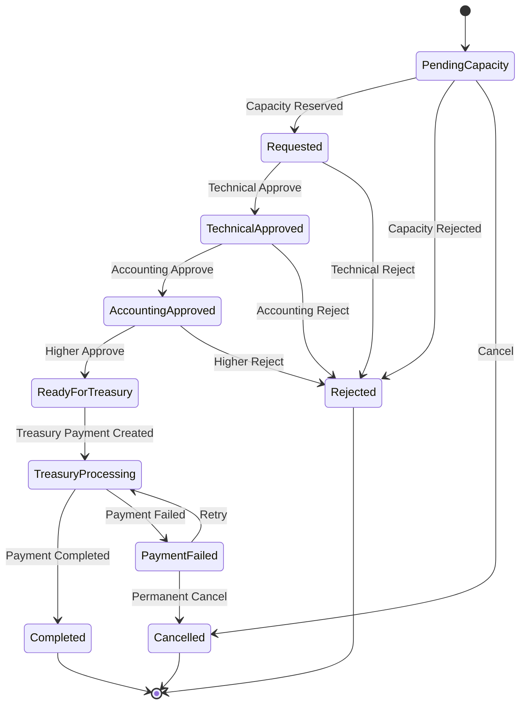
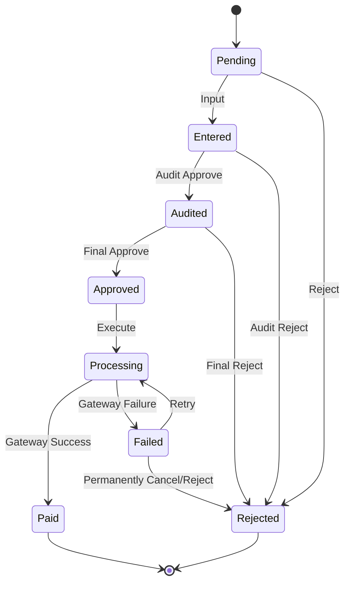
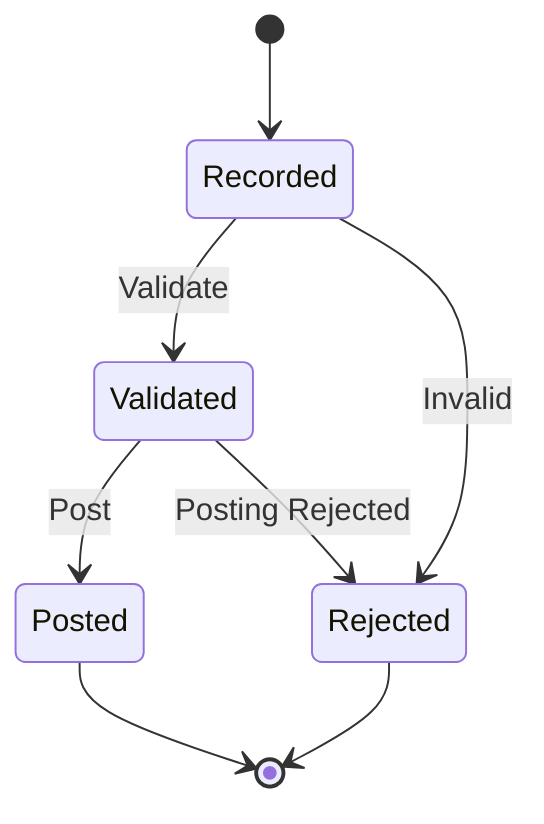
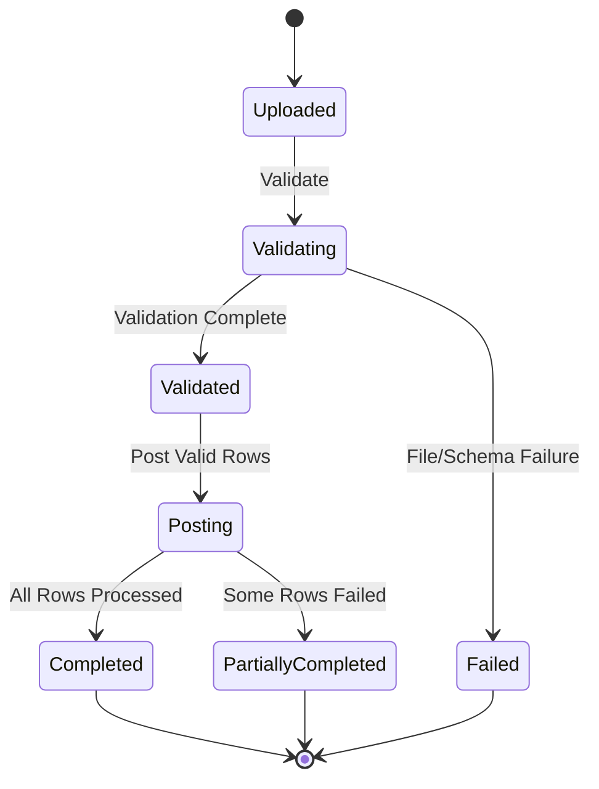

# Loan Management System — Domain State Machines

## 1. Purpose

This document defines the initial state transitions for the primary MVP aggregates.

The state machines are implementation baselines. Invalid transitions must be rejected by domain logic rather than only by UI rules.

---

# 2. Loan Application State Machine

### Terminal states

- Approved
- Rejected
- Cancelled

Application does not become a Loan Account by changing its state.

`Approved` triggers creation of a separate Loan Account.

---

# 3. Property Inspection State Machine

If reinspection is later required, create an explicit reinspection workflow rather than editing a finalized inspection in place.

---

# 4. Loan Account State Machine

The exact naming may evolve when interest/accounting requirements are finalized.

Financial totals and reservations are invariants independent of display status.

---

# 5. Disbursement State Machine

### Capacity rule

Capacity is reserved from `PendingCapacity → Requested`.

Capacity is released if the disbursement reaches `Rejected` or `Cancelled` before successful payment.

On `Completed`, the reservation becomes confirmed disbursed principal.

---

# 6. Treasury Payment State Machine

`Paid` is terminal for the same payment order.

Repeated external success callbacks must be idempotent.

---

# 7. Repayment State Machine

A posted repayment is immutable.

Corrections, if later supported, should use explicit reversal/adjustment transactions rather than editing posted history.

---

# 8. Salary Deduction Batch State Machine

Individual row failures do not require rolling back successful independent repayments unless the business later requires all-or-nothing batch semantics.

---

# 9. Transition Enforcement

Every state-changing domain method must verify:

1. current state;
2. actor authorization at application boundary;
3. business prerequisites;
4. idempotency where applicable;
5. concurrency token/version;
6. invariant preservation.

Frontend controls may hide unavailable actions, but backend/domain logic remains authoritative.

---

# 10. Baseline

These state machines should be reflected in:

- aggregate methods;
- API command handlers;
- validation tests;
- architecture documentation;
- negative-path integration tests.
