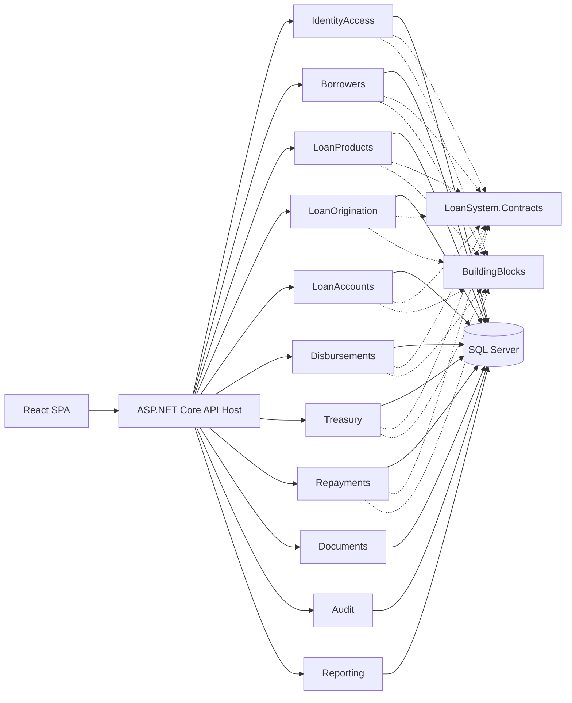

# Loan Management System — Solution Architecture

## 1. Purpose

This document defines the technical solution architecture for the Loan Management System MVP.

It translates the DDD context map and module contracts into a concrete ASP.NET Core solution structure.

The architecture is intentionally pragmatic:

- Modular Monolith at deployment level;
- DDD at business boundaries;
- Clean Architecture dependency rules;
- one implementation assembly per module;
- explicit cross-module contracts;
- architecture tests instead of four assemblies per module;
- one SQL Server database with module-owned schemas/DbContexts;
- reliable in-process integration events using Outbox/Inbox.

---

## 2. Technology Baseline

### Backend

- .NET 10 LTS
- ASP.NET Core
- Entity Framework Core
- Microsoft SQL Server
- REST API
- OpenAPI
- Background hosted services for Outbox dispatch

### Frontend

- React
- TypeScript
- Vite-based SPA
- React Router
- TanStack Query for server state
- schema-based form/input validation
- OpenAPI-derived client types when API contracts stabilize

### Deployment

```text
React SPA
    +
ASP.NET Core Backend
    +
SQL Server
```

No microservices and no external message broker are required for the MVP.

---

## 3. High-Level Architecture



---

## 4. Assembly Strategy

### Decision

Use:

```text
One implementation project per business module
+
One shared Contracts project
+
Small technical BuildingBlocks projects
```

Do **not** create four projects per module for Domain/Application/Infrastructure/Presentation. That would create excessive project/assembly ceremony for the MVP.

Instead, each module implementation project contains these internal namespaces/folders and architecture tests enforce dependency rules.

---

## 5. Backend Solution Structure

```text
LoanSystem.sln

src/
├── LoanSystem.Api/
│
├── LoanSystem.Contracts/
│
├── BuildingBlocks/
│   ├── LoanSystem.BuildingBlocks.Domain/
│   ├── LoanSystem.BuildingBlocks.Application/
│   └── LoanSystem.BuildingBlocks.Infrastructure/
│
└── Modules/
    ├── IdentityAccess/
    │   └── LoanSystem.Modules.IdentityAccess/
    ├── Borrowers/
    │   └── LoanSystem.Modules.Borrowers/
    ├── LoanProducts/
    │   └── LoanSystem.Modules.LoanProducts/
    ├── LoanOrigination/
    │   └── LoanSystem.Modules.LoanOrigination/
    ├── LoanAccounts/
    │   └── LoanSystem.Modules.LoanAccounts/
    ├── Disbursements/
    │   └── LoanSystem.Modules.Disbursements/
    ├── Treasury/
    │   └── LoanSystem.Modules.Treasury/
    ├── Repayments/
    │   └── LoanSystem.Modules.Repayments/
    ├── Documents/
    │   └── LoanSystem.Modules.Documents/
    ├── Audit/
    │   └── LoanSystem.Modules.Audit/
    └── Reporting/
        └── LoanSystem.Modules.Reporting/

tests/
├── LoanSystem.Domain.Tests/
├── LoanSystem.Application.Tests/
├── LoanSystem.IntegrationTests/
├── LoanSystem.Api.Tests/
├── LoanSystem.ArchitectureTests/
└── LoanSystem.E2E.Tests/

frontend/
└── loan-system-web/
```

---

## 6. Internal Module Structure

Each module implementation project follows:

```text
LoanSystem.Modules.LoanOrigination/

├── Domain/
│   ├── Aggregates/
│   ├── Entities/
│   ├── ValueObjects/
│   ├── Events/
│   ├── Policies/
│   ├── Errors/
│   └── Services/
│
├── Application/
│   ├── Commands/
│   ├── Queries/
│   ├── Handlers/
│   ├── Validators/
│   ├── DTOs/
│   ├── EventHandlers/
│   └── Services/
│
├── Infrastructure/
│   ├── Persistence/
│   │   ├── Configurations/
│   │   ├── Repositories/
│   │   └── Migrations/
│   ├── Integrations/
│   ├── Outbox/
│   └── DependencyInjection/
│
├── Presentation/
│   ├── Endpoints/
│   ├── Requests/
│   ├── Responses/
│   └── Mapping/
│
└── ModuleRegistration.cs
```

Not every folder must exist from day one. Add folders only when code exists.

---

## 7. Internal Dependency Rules

Within a module:

```text
Presentation
     ↓
Application
     ↓
Domain

Infrastructure
     ↓
Application
     ↓
Domain
```

Allowed:

```text
Application -> Domain
Infrastructure -> Application
Infrastructure -> Domain
Presentation -> Application
```

Forbidden:

```text
Domain -> Application
Domain -> Infrastructure
Domain -> Presentation

Application -> Infrastructure
Application -> Presentation
```

Because all layers are in one assembly, these rules are enforced by namespace conventions, code review, and architecture tests.

---

## 8. Cross-Module Dependency Rules

Implementation projects do not reference other module implementation projects.

Forbidden:

```text
LoanOrigination -> Borrowers implementation
Disbursements -> LoanAccounts implementation
```

Allowed:

```text
LoanOrigination -> LoanSystem.Contracts
Disbursements -> LoanSystem.Contracts
```

Synchronous contracts and integration-event schemas live in `LoanSystem.Contracts`.

---

## 9. LoanSystem.Contracts

Purpose: the only production assembly intended for cross-module business contracts.

```text
LoanSystem.Contracts/

├── Identity/
├── Borrowers/
│   ├── IBorrowersModule.cs
│   └── BorrowerSnapshot.cs
├── LoanProducts/
│   ├── ILoanProductsModule.cs
│   └── LoanProductVersionSnapshot.cs
├── LoanOrigination/
│   └── Events/
│       └── LoanApplicationApprovedV1.cs
├── LoanAccounts/
│   ├── ILoanAccountsModule.cs
│   └── Events/
├── Disbursements/
│   └── Events/
├── Treasury/
│   └── Events/
└── Repayments/
    └── Events/
```

Contracts may contain only:

- interfaces intentionally exposed to other modules;
- immutable contract DTOs;
- integration events;
- stable contract enums where justified.

Contracts must not contain aggregates, domain behavior, repositories, EF types, DbContexts, or infrastructure code.

---

## 10. Building Blocks

### 10.1 Domain Building Blocks

`LoanSystem.BuildingBlocks.Domain`

May contain:

```text
Entity
AggregateRoot
IDomainEvent
DomainError
StronglyTypedId support
```

Avoid putting loan-specific concepts here.

### 10.2 Application Building Blocks

`LoanSystem.BuildingBlocks.Application`

May contain:

```text
ICommand
ICommandHandler
IQuery
IQueryHandler
ApplicationResult
Pagination primitives
Authorization abstractions
Validation abstractions
```

Lightweight CQRS does not require a mediator library. Endpoints may inject handlers directly.

### 10.3 Infrastructure Building Blocks

`LoanSystem.BuildingBlocks.Infrastructure`

May contain:

```text
Outbox abstractions/dispatcher
Inbox processing
Idempotency infrastructure
Correlation helpers
EF transaction helpers
Database naming conventions
Observability helpers
```

No business rules belong here.

---

## 11. ASP.NET Core Host

`LoanSystem.Api` is the composition root.

Responsibilities:

- configuration;
- dependency injection;
- authentication middleware;
- authorization policies;
- ProblemDetails/error middleware;
- correlation middleware;
- OpenAPI;
- health checks;
- module registration;
- endpoint mapping;
- hosted background dispatchers.

It must not contain loan business logic.

Conceptually:

```csharp
builder.Services
    .AddIdentityAccessModule(configuration)
    .AddBorrowersModule(configuration)
    .AddLoanProductsModule(configuration)
    .AddLoanOriginationModule(configuration)
    .AddLoanAccountsModule(configuration)
    .AddDisbursementsModule(configuration)
    .AddTreasuryModule(configuration)
    .AddRepaymentsModule(configuration)
    .AddDocumentsModule(configuration)
    .AddAuditModule(configuration)
    .AddReportingModule(configuration);
```

### API style baseline

Use **Minimal API route groups** for the MVP.

Reasoning:

- thin endpoints;
- natural grouping by module;
- lower controller ceremony;
- compatible with authorization and OpenAPI.

The architectural rule matters more than Minimal API vs Controllers.

---

## 12. CQRS Implementation Style

Command flow:

```text
POST /loan-applications/{id}/submit
        ↓
SubmitLoanApplicationCommand
        ↓
SubmitLoanApplicationHandler
        ↓
LoanApplication.Submit()
        ↓
Repository
        ↓
Transaction + Outbox
```

Query flow:

```text
GET /loan-applications/{id}
        ↓
GetLoanApplicationQuery
        ↓
GetLoanApplicationHandler
        ↓
Read Model
```

Do not force every internal call through a mediator pipeline.

---

## 13. Persistence Boundary Baseline

Detailed table design is a later step, but the architectural decision is:

```text
One SQL Server database
+
Separate schema per module
+
Separate DbContext per module
```

Example schemas:

```text
identity.*
borrowers.*
loan_products.*
loan_origination.*
loan_accounts.*
disbursements.*
treasury.*
repayments.*
documents.*
audit.*
reporting.*
```

Example DbContexts:

```text
IdentityAccessDbContext
BorrowersDbContext
LoanProductsDbContext
LoanOriginationDbContext
LoanAccountsDbContext
DisbursementsDbContext
TreasuryDbContext
RepaymentsDbContext
DocumentsDbContext
AuditDbContext
ReportingDbContext
```

A DbContext must never expose another module's tables.

---

## 14. Database Transactions

Transaction scope stays inside one module/DbContext.

Do not create transactions spanning multiple module DbContexts.

Cross-module coordination uses Outbox/Inbox.

---

## 15. Outbox / Inbox

```text
Local Module Transaction
        ↓
Domain state + Outbox row committed
        ↓
Background dispatcher
        ↓
In-process integration event dispatch
        ↓
Consumer Inbox/idempotency check
        ↓
Consumer local transaction
```

No external broker is needed for MVP.

---

## 16. Module Registration

Each module exposes a small registration surface to the host:

```text
Add<Module>Module(...)
Map<Module>Endpoints(...)
```

Everything else should be internal where practical.

---

## 17. Visibility Strategy

Prefer `internal` for:

- aggregates;
- repositories;
- DbContexts;
- application handlers;
- infrastructure services;
- endpoint implementation details.

Expose publicly only module registration extensions and genuine shared contracts.

Tests may use `InternalsVisibleTo` selectively.

---

## 18. Configuration

Use strongly typed options.

Examples:

```text
AuthenticationOptions
FileStorageOptions
PaymentGatewayOptions
OutboxOptions
```

Secrets do not belong in repository configuration files.

---

## 19. External Adapters

### Identity

```text
IIdentityProvider
├── LocalIdentityProvider       MVP
└── ActiveDirectoryProvider     Later
```

### Borrower Source

```text
IBorrowerSource
├── Manual
├── Excel
└── HrApi                       Later
```

### Treasury

```text
IPaymentGateway
├── FakePaymentGateway          MVP
└── B2BPaymentGateway           Later
```

### Documents

```text
IFileStorage
├── LocalFileStorage            MVP
└── FileServerStorage           Later
```

Interfaces live in the owning module/application boundary; implementations live in Infrastructure.

---

## 20. API Error Handling

Central error translation maps:

```text
ValidationFailure       -> 400/422
NotFound                -> 404
Forbidden               -> 403
StateConflict           -> 409
ConcurrencyConflict     -> 412
Unexpected Error        -> 500
```

Responses use `ProblemDetails` plus stable error codes.

Domain code must not construct HTTP responses.

---

## 21. Time

Use UTC for timestamps.

Prefer a time abstraction such as .NET `TimeProvider` rather than scattered direct system-clock calls.

Business dates and timestamps remain distinct concepts.

---

## 22. IDs

Prefer strongly typed identifiers at domain level:

```text
BorrowerId
LoanApplicationId
LoanId
DisbursementId
TreasuryPaymentId
RepaymentId
```

They may serialize as GUIDs at API/database boundaries.

---

## 23. Logging and Observability

Structured logs should include:

- CorrelationId
- UserId where appropriate
- Module
- UseCase
- AggregateId where useful
- EventId for event processing

Do not log passwords, secrets, or unnecessary personal-document content.

Operational metrics should later include:

- Outbox backlog
- failed event deliveries
- failed payment executions
- API error rate
- integration retry counts

---

## 24. Background Processing

ASP.NET Core hosted services are sufficient for MVP jobs such as:

- Outbox dispatch;
- retryable event processing;
- temporary import-file cleanup.

Do not introduce a distributed job platform without a demonstrated requirement.

---

## 25. Security Architecture

Server-side controls:

- authentication;
- permission-based authorization;
- separation of duties;
- validation;
- optimistic concurrency;
- idempotency;
- secure file access;
- audit trail.

React UI visibility is never a security boundary.

---

## 26. Development and Deployment Shape

Recommended local dependencies:

```text
Backend
Frontend
SQL Server
```

Docker Compose can provide a consistent local environment.

Production may deploy:

```text
React static assets / web server
ASP.NET Core application
SQL Server
File storage
```

without changing bounded-context architecture.

---

## 27. Architecture Test Rules

Automated architecture tests must enforce at least:

1. Module Domain namespaces do not depend on Application.
2. Module Domain does not depend on Infrastructure.
3. Module Domain does not depend on Presentation.
4. Application does not depend on Infrastructure.
5. One module implementation does not reference another module implementation.
6. Cross-module business dependencies go through `LoanSystem.Contracts`.
7. DbContexts are internal to their module.
8. API host contains no Domain business behavior.
9. Reporting is not referenced by transactional modules.
10. Audit is not used as transactional source of truth.

---

## 28. Explicitly Avoided for MVP

```text
No microservices
No distributed transaction
No Kafka/RabbitMQ requirement
No service mesh
No shared cross-module DbContext
No generic workflow engine
No generic repository over every entity
No four-project-per-module explosion
No business logic in endpoints
No business logic in React
```

---

## 29. Evolution Path

A module can later be extracted because it already has:

```text
own schema
own DbContext
explicit contracts
integration events
no direct cross-module database dependency
```

Extraction remains an option, not an MVP goal.

---

## 30. Baseline

This document is the implementation architecture baseline.

Next technical design step:

```text
Persistence Design
    ↓
SQL Server schemas
    ↓
EF Core entity mappings
    ↓
indexes / constraints
    ↓
concurrency tokens
    ↓
Outbox / Inbox tables
    ↓
migration strategy
```
